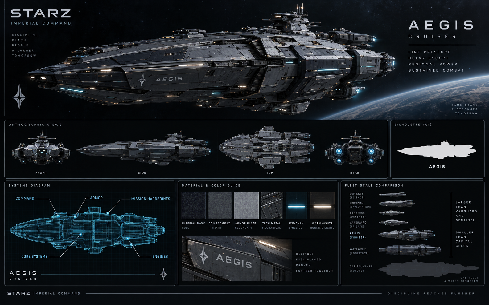

# Aegis — Cruiser

[Índice da frota](README.md) · [Escala](FLEET-SCALE-GUIDE.md) · [Manifesto](SHIP-ASSET-MANIFEST.md)

Rodada: V2 — expansão da frota. Direção: Imperial Command.

## Função

Presença de linha, combate sustentado, escolta pesada e projeção regional.

## Silhueta e arquitetura

Casco central equilibrado, ombros protegidos, blocos funcionais em camadas e comando dorsal com propulsão resguardada.

É a plataforma militar madura e estável da família. Distinguir sua massa equilibrada da postura ofensiva e afilada de Spearhead.

## Regiões funcionais

- Comando e proteção estrutural.
- Hardpoints integrados e sistemas centrais.
- Motores e suporte de casco.

## Materiais e identificação

Navy espacial, graphite e cold metal; emissivos ice-cyan contidos e iluminação funcional warm-white. Preservar grandes superfícies, proporções e detalhes de manutenção. O nome da nave ou identificação de classe pertence ao casco; STARZ identifica a organização nas pranchas.

## Conteúdo da prancha

Hero, vistas front/side/top/rear, esquema técnico, silhueta e guia de materiais estão reunidos no PNG. São referências conceituais: a consistência geométrica entre vistas precisa ser validada na futura modelagem.

## Preparação de assets

- Preservar o PNG original de apresentação.
- Exportar futuramente hero separado em PNG/WebP e silhueta/esquema em SVG.
- Criar futuramente modelo 3D com níveis de detalhe, mantendo a silhueta no nível mais simples.
- Conferir [handoff](CODEX-SHIP-HANDOFF.md) antes de qualquer integração.

O pacote não define dimensões físicas, estatísticas ou disponibilidade desta nave na API.

