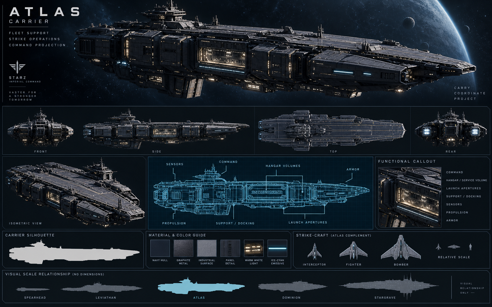

# Atlas — Carrier

[Índice da frota](README.md) · [Escala](FLEET-SCALE-GUIDE.md) · [Manifesto](SHIP-ASSET-MANIFEST.md)

Rodada: V3 — capital ships. Direção: Imperial Command.

## Função

Suporte de frota, operações de strike craft, comando e projeção de longo alcance.

## Silhueta e arquitetura

Arquitetura modular organizada ao redor de hangares, aberturas de lançamento, áreas de serviço e volume operacional.

A arquitetura deve nascer da operação aérea/espacial subordinada. Interceptor, Fighter e Bomber pertencem ao complemento do Atlas, sem contar como classes independentes da frota principal.

## Regiões funcionais

- Seção de comando e sensores.
- Volumes de hangar, aberturas de lançamento e manutenção.
- Docagem, suporte, proteção e propulsão.

## Materiais e identificação

Navy espacial, graphite e cold metal; emissivos ice-cyan contidos e iluminação funcional warm-white. Preservar grandes superfícies, proporções e detalhes de manutenção. O nome da nave ou identificação de classe pertence ao casco; STARZ identifica a organização nas pranchas.

## Conteúdo da prancha

Hero, vistas front/side/top/rear, esquema técnico, silhueta e guia de materiais estão reunidos no PNG. A prancha inclui também vista isométrica e callouts funcionais. São referências conceituais: a consistência geométrica entre vistas precisa ser validada na futura modelagem.

## Unidades subordinadas

- [Interceptor](INTERCEPTOR.md)
- [Fighter](FIGHTER.md)
- [Bomber](BOMBER.md)

As três aparecem no painel de strike craft da prancha Atlas. Ainda não há arquivos raster ou vetoriais individuais para elas.

## Preparação de assets

- Preservar o PNG original de apresentação.
- Exportar futuramente hero separado em PNG/WebP e silhueta/esquema em SVG.
- Criar futuramente modelo 3D com níveis de detalhe, mantendo a silhueta no nível mais simples.
- Conferir [handoff](CODEX-SHIP-HANDOFF.md) antes de qualquer integração.

O pacote não define dimensões físicas, estatísticas ou disponibilidade desta nave na API.

