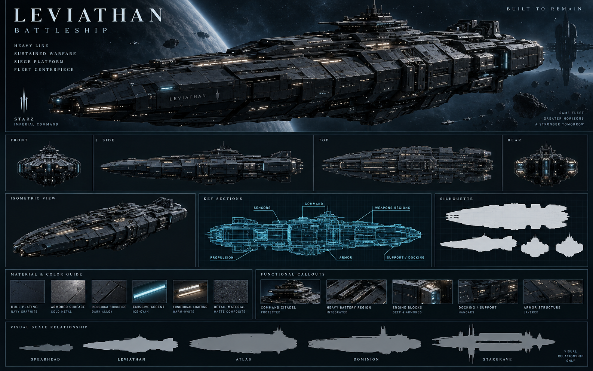

# Leviathan — Battleship

[Índice da frota](README.md) · [Escala](FLEET-SCALE-GUIDE.md) · [Manifesto](SHIP-ASSET-MANIFEST.md)

Rodada: V3 — capital ships. Direção: Imperial Command.

## Função

Combate pesado de linha, guerra sustentada, bateria pesada e engajamento de cerco.

## Silhueta e arquitetura

Casco longitudinal massivo com seções blindadas, grande profundidade estrutural e motores grandes. A postura transmite peso e permanência.

O casco deve transmitir capacidade de permanecer na linha quando escoltas recuam. Evitar a impressão de agilidade que caracteriza Spearhead.

## Regiões funcionais

- Cidadela de comando protegida e sensores.
- Regiões de bateria pesada e blindagem em camadas.
- Blocos de propulsão, docagem e suporte.

## Materiais e identificação

Navy espacial, graphite e cold metal; emissivos ice-cyan contidos e iluminação funcional warm-white. Preservar grandes superfícies, proporções e detalhes de manutenção. O nome da nave ou identificação de classe pertence ao casco; STARZ identifica a organização nas pranchas.

## Conteúdo da prancha

Hero, vistas front/side/top/rear, esquema técnico, silhueta e guia de materiais estão reunidos no PNG. A prancha inclui também vista isométrica e callouts funcionais. São referências conceituais: a consistência geométrica entre vistas precisa ser validada na futura modelagem.

## Preparação de assets

- Preservar o PNG original de apresentação.
- Exportar futuramente hero separado em PNG/WebP e silhueta/esquema em SVG.
- Criar futuramente modelo 3D com níveis de detalhe, mantendo a silhueta no nível mais simples.
- Conferir [handoff](CODEX-SHIP-HANDOFF.md) antes de qualquer integração.

O pacote não define dimensões físicas, estatísticas ou disponibilidade desta nave na API.

