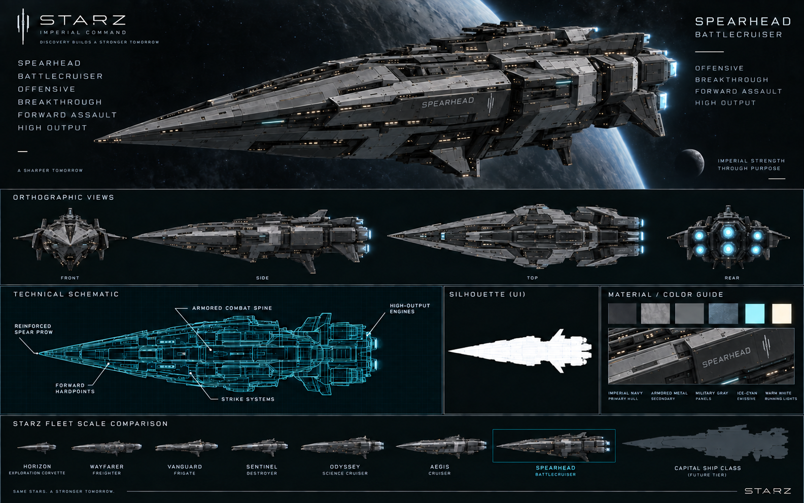

# Spearhead — Battlecruiser

[Índice da frota](README.md) · [Escala](FLEET-SCALE-GUIDE.md) · [Manifesto](SHIP-ASSET-MANIFEST.md)

Rodada: V2 — revisão de silhueta e identificação. Direção: Imperial Command.

## Função

Ofensiva, ruptura de linha e assalto frontal.

## Silhueta e arquitetura

Proa em lança dominante, eixo de combate blindado, hardpoints dianteiros, comando baixo e propulsão traseira de alta potência.

Usar exclusivamente a revisão com SPEARHEAD escrito no casco e no detalhe de materiais. As duas versões anteriores foram superadas e não fazem parte deste pacote.

## Regiões funcionais

- Proa reforçada e hardpoints frontais.
- Espinha de combate, sistemas de ataque e blindagem.
- Comando integrado e motores traseiros.

## Materiais e identificação

Navy espacial, graphite e cold metal; emissivos ice-cyan contidos e iluminação funcional warm-white. Preservar grandes superfícies, proporções e detalhes de manutenção. O nome da nave ou identificação de classe pertence ao casco; STARZ identifica a organização nas pranchas.

## Conteúdo da prancha

Hero, vistas front/side/top/rear, esquema técnico, silhueta e guia de materiais estão reunidos no PNG. São referências conceituais: a consistência geométrica entre vistas precisa ser validada na futura modelagem.

## Preparação de assets

- Preservar o PNG original de apresentação.
- Exportar futuramente hero separado em PNG/WebP e silhueta/esquema em SVG.
- Criar futuramente modelo 3D com níveis de detalhe, mantendo a silhueta no nível mais simples.
- Conferir [handoff](CODEX-SHIP-HANDOFF.md) antes de qualquer integração.

O pacote não define dimensões físicas, estatísticas ou disponibilidade desta nave na API.

