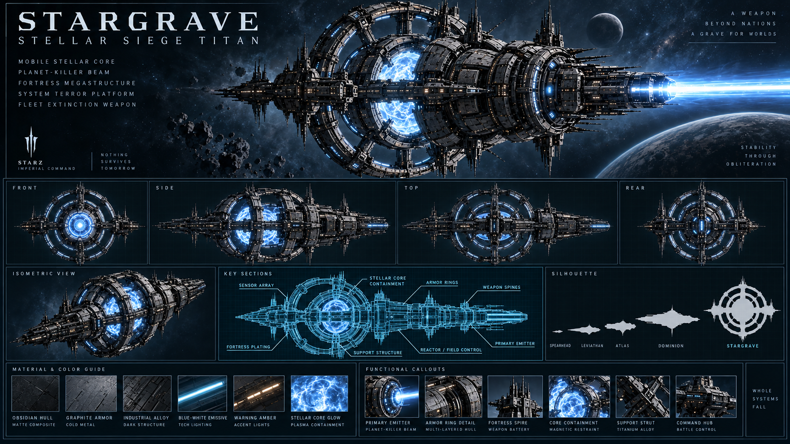

# Stargrave-class — Titan

[Índice da frota](README.md) · [Escala](FLEET-SCALE-GUIDE.md) · [Manifesto](SHIP-ASSET-MANIFEST.md)

Rodada: V3 — supercapital. Direção: Imperial Command.

## Função

Titan de cerco estratégico, centro da frota de endgame e plataforma extrema de comando e projeção. O novo asset o identifica como **Stellar Siege Titan**: uma arma de escala interestelar, construída para projetar poder além de uma única nação.

## Silhueta e arquitetura

Núcleo estelar móvel contido por anéis de blindagem e contenção, espinha central de armas e um emissor primário de alta energia. A arquitetura combina fortaleza de megastruturas, volumes internos profundos, camadas estruturais e módulos industriais gigantescos com docagem e serviço.

Stargrave é a classe, não um nome individual obrigatório. A prancha individual define o casco longitudinal modular; os quadros coletivos exibem uma versão mais vertical e não substituem esta referência.

## Regiões funcionais

- Seção de comando e espinha central.
- Núcleo estelar móvel e anéis de contenção.
- Emissor primário / arma de extinção planetária.
- Blocos de armas, blindagem de fortaleza e suportes de titânio.
- Estruturas de docagem, propulsão e estruturas secundárias.

## Materiais e identificação

Navy espacial, graphite e cold metal; emissivos ice-cyan contidos e iluminação funcional warm-white. Preservar grandes superfícies, proporções e detalhes de manutenção. O nome da nave ou identificação de classe pertence ao casco; STARZ identifica a organização nas pranchas.

## Conteúdo da prancha

Hero, vistas front/side/top/rear, esquema técnico, silhueta e guia de materiais estão reunidos no PNG. A prancha inclui também vista isométrica e callouts funcionais. São referências conceituais: a consistência geométrica entre vistas precisa ser validada na futura modelagem.

## Identidade e modularização

- Classificação: Titan.
- Classe: Stargrave-class.
- Nome individual: não definido nesta etapa; “End of Dawn” foi apenas um exemplo futuro no briefing.
- Restrição do conceito fornecido: máximo de um Titan ativo por império, reconstruível se destruído; não é globalmente único. Isso não comprova implementação no jogo.

Dividir o futuro modelo em comando, espinha central, propulsão, blocos de armas, módulos de blindagem, docagem e estruturas secundárias. Horizon, Vanguard, Aegis e Leviathan são referências de escolta para comunicar escala no hero.

## Preparação de assets

- Preservar o PNG original de apresentação.
- Exportar futuramente hero separado em PNG/WebP e silhueta/esquema em SVG.
- Criar futuramente modelo 3D com níveis de detalhe, mantendo a silhueta no nível mais simples.
- Conferir [handoff](CODEX-SHIP-HANDOFF.md) antes de qualquer integração.

O pacote não define dimensões físicas, estatísticas ou disponibilidade desta nave na API.

