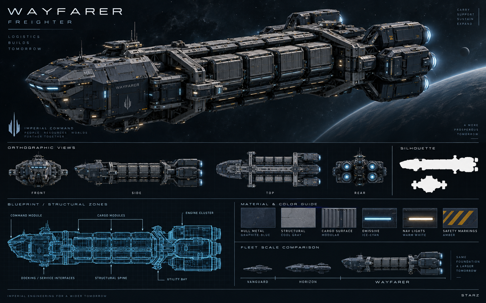

# Wayfarer — Freighter

[Índice da frota](README.md) · [Escala](FLEET-SCALE-GUIDE.md) · [Manifesto](SHIP-ASSET-MANIFEST.md)

Rodada: V1 — frota inicial. Direção: Imperial Command.

## Função

Transporte, logística e sustentação da expansão.

## Silhueta e arquitetura

Espinha estrutural comprida com módulos de carga repetidos, comando dianteiro e blocos de propulsão volumosos.

O volume deriva da carga. A posição no catálogo não determina uma escala linear com as classes militares; pode ter mais volume que uma escolta ou cruiser.

## Regiões funcionais

- Módulo de comando frontal.
- Módulos de carga e espinha estrutural.
- Interfaces de docagem, compartimento utilitário e motores.

## Materiais e identificação

Navy espacial, graphite e cold metal; emissivos ice-cyan contidos e iluminação funcional warm-white. Preservar grandes superfícies, proporções e detalhes de manutenção. O nome da nave ou identificação de classe pertence ao casco; STARZ identifica a organização nas pranchas.

## Conteúdo da prancha

Hero, vistas front/side/top/rear, esquema técnico, silhueta e guia de materiais estão reunidos no PNG. São referências conceituais: a consistência geométrica entre vistas precisa ser validada na futura modelagem.

## Preparação de assets

- Preservar o PNG original de apresentação.
- Exportar futuramente hero separado em PNG/WebP e silhueta/esquema em SVG.
- Criar futuramente modelo 3D com níveis de detalhe, mantendo a silhueta no nível mais simples.
- Conferir [handoff](CODEX-SHIP-HANDOFF.md) antes de qualquer integração.

O pacote não define dimensões físicas, estatísticas ou disponibilidade desta nave na API.

